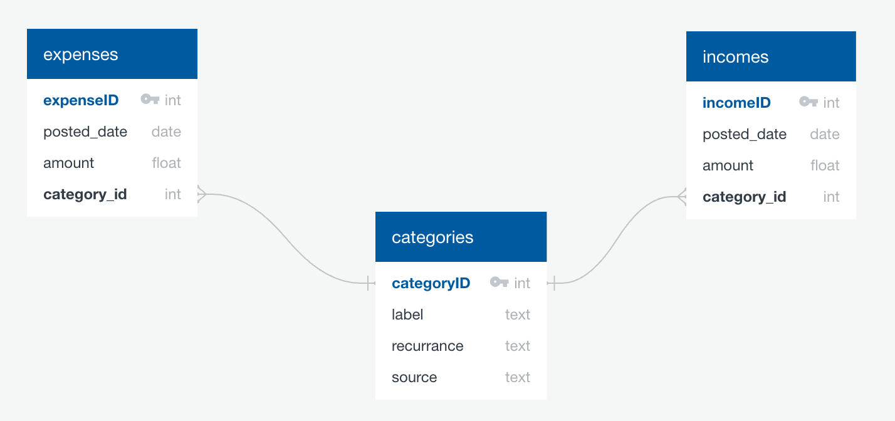

# FinTrackr: Personal finances and budgeting app



*Schema diagram made at , using SQL_to_EDL.py in this repo (so inconsistency with actual db schema is possible!)*

## Inputs

Users provide csvs of transactions (e.g. downloaded credit card statements from your bank).

FinTrackr will then classify each transaction (expense or income) by category (groceries, eating out, etc) and whether the expense is recurring, and on what frequency. Initially classification will be manual, but v2 will use an ML model (classical or LLM, TBD).

Security: the database runs locally, nothing leaves your machine.

## Use cases

The (eventual) interface will include visualizations of account balance over time, monthly budgets calculated from both anticipated recurring expenses and extrapolations from past irregular expenditures, etc.

## Getting started

Install PostgreSQL (TODO add more install instructions).

Run (TODO add testing coverage for CLI version of init_db)

```
python ./src/fintrackr/init_db.py <database admin password>
```

from the command line. A bunch of `CREATE` statements should print. This creates the Fintrackr database with owner name `fintrackr_admin` and the login password for `fintrackr_admin` that you specify. `fintrackr_admin` can create the database and create users. Admin name and db name are specified in the `config.yml` file.

Add new users with:

```
python ./src/fintrackr/add_user.py <new user name> <new user password> <db admin password>
```

Users are associated with data they add to the database. They can modify all tables but can't create users/roles; therefore the db owner's password must be passed so the admin can create the new user.

## Dev

This package uses `uv` for package and virtual environment management, based on the very helpful tutorials at [Sebastia Agramunt Puig's blog](https://agramunt.me/posts/python-virtual-environments-with-uv/).

Create the environment with `uv venv .venv` and then run `uv sync --all-extras` (to get developer extras).

Activate with `source .venv/bin/activate`.

Add dependencies with `uv add <package1> <package2>`. If you get an error that looks like:

```
No solution found when resolving dependencies:
  ╰─▶ Because there are no versions of unittest and your project depends on unittest, we can conclude that your project's requirements are
      unsatisfiable.
```
you already have the package (e.g. it's a package that comes with all python installs). I love `uv` but its error messages can be quite unhelpful.

Use `pytest` to run the tests. (For quick debugging: Add `-s` or `--capture=no` to print print statements to console.)

Quick manual testing/debugging setup using the tools in `testing_utils.py`:

```
import fintrackr.testing_utils as utils
params = utils.config_params()
FinDB = utils.set_up_test_DB(params=params)
```

When done, run in the Terminal:

```
dropdb test_fin_db
dropuser test_user
dropuser test_admin
```

To regenerate the schema diagram, run `python src/fintrackr/SQL_to_EDL.py src/fintrackr/schema.sql`. A file `schema_EDL.txt` will appear in `src/fintrackr`.

## TODO 
- Automatically infer transactions to ignore (e.g. credit card payments from checking account, if have both lists of transactions and can compare)?
- Infer, or at least check, recurring charges and their frequencies
- Have a "MANUAL" category that requires manual intervention - e.g. Amazon transactions can't be categorized just from credit card data.