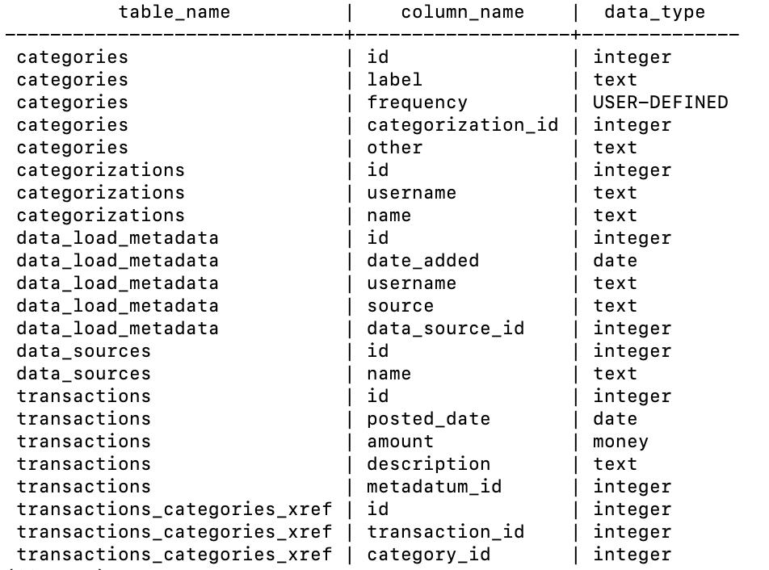

# FinTrackr: Personal finances and budgeting app


*Schema diagram made at app.quickdatabasediagrams.com*

WIP - schema is aspirational, no guarantee yet it matches the code! *TODO write code to convert SQL to EDL*

Schema pulled from database:



## Inputs

Users can either provide a csv of data (e.g. credit card statements downloaded from a bank), or enter transactions manually.

FinTrackr will then classify each transaction (expense or income) by category (groceries, eating out, etc) and whether the expense is recurring, and on what frequency. Initially classification will be manual, but v2 will use an LLM agent.

## Use cases

The (eventual) interface will include visualizations of money on hand over time, monthly budgets calculated from both anticipated recurring expenses and extrapolations from past irregular expenditures, etc.

## Getting started

Run 

```
python ./src/fintrackr/init_db.py
```

from the command line. A bunch of `CREATE` statements should print.

## Dev

This package uses `uv` for package and virtual environment management, based on the very helpful tutorials at [Sebastia Agramunt Puig's blog](https://agramunt.me/posts/python-virtual-environments-with-uv/).

Create the environment with `uv venv .venv` and then run `uv sync --all-extras` (to get developer extras).

Activate with `source .venv/bin/activate`.

Add dependencies with `uv add <package1> <package2>`. If you get an error that looks like:

```
No solution found when resolving dependencies:
  ╰─▶ Because there are no versions of unittest and your project depends on unittest, we can conclude that your project's requirements are
      unsatisfiable.
```
you already have the package (e.g. it's a package that comes with all python installs). I love `uv` but its error messages can be quite unhelpful.

Use `pytest` to run the tests. Add `-s` to print print statements to console.


## TODO 
- Automatically infer transactions to ignore (credit card payments from checking account). In MVP these are labeled "ignore"
- Infer, or at least check, recurring charges and their frequencies
- Have a "check" category that requires manual intervention - e.g. Amazon transactions can't be categorized just from credit card data.