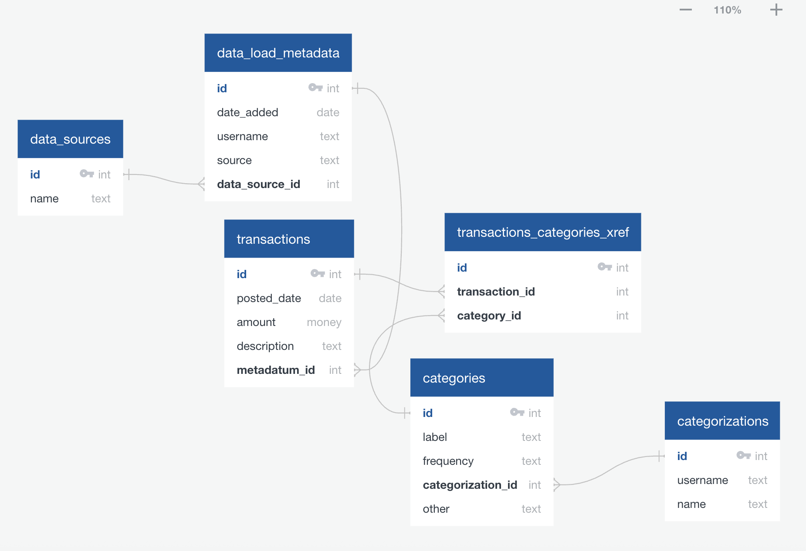

# FinTrackr: Personal finances and budgeting app

*Schema diagram made at app.quickdatabasediagrams.com*

WIP - schema is aspirational, no guarantee yet it matches the code! *TODO write code to convert SQL to EDL*

## Inputs

Users can either provide a csv of data (e.g. credit card statements downloaded from a bank), or enter transactions manually.

FinTrackr will then classify each transaction (expense or income) by category (groceries, eating out, etc) and whether the expense is recurring, and on what frequency. Initially classification will be manual, but v2 will use an LLM agent.

## Use cases

The (eventual) interface will include visualizations of money on hand over time, monthly budgets calculated from both anticipated recurring expenses and extrapolations from past irregular expenditures, etc.

## TODO 
- Automatically infer transactions to ignore (credit card payments from checking account). In MVP these are labeled "ignore"
- Infer, or at least check, recurring charges and their frequencies
- Have a "check" category that requires manual intervention - e.g. Amazon transactions can't be categorized just from credit card data.